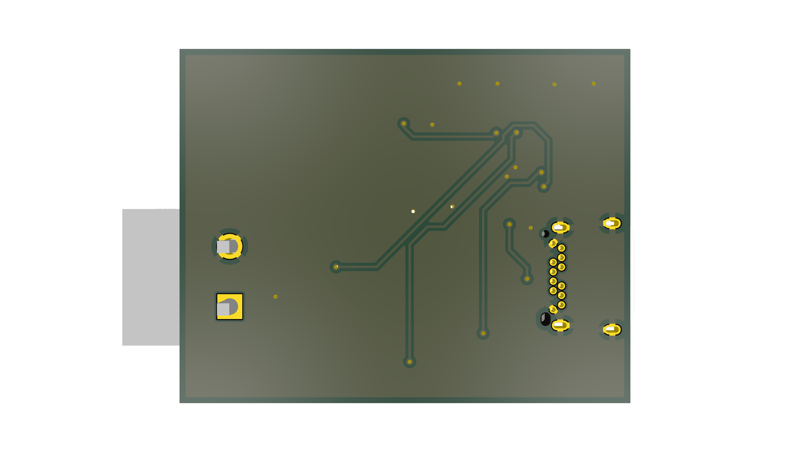

# USB-PD-Trigger-Board
>
> USB Power Delivery Sink Board based on CYPD3177

## Overview

This repository hosts the **KiCAD hardware design**, **documentation**, and **manufacturing outputs** for the USB-PD-Trigger-Board. This board is designed to negotiate high voltage power from USB-PD sources.

---

## Repository Layout

| Folder / File | Description |
|----------------|-------------|
| [`assets/`](./assets/) | Renders, screenshots, templates |
| [`docs/`](./docs/) | ICDs, Design Documents, Release info |
| [`Subsheets/`](./Subsheets/) | Secondary schematic sheets |
| [`packages3D/`](./packages3D/) | 3D component models |
| [`simulation/`](./simulation/) | Simulation files and results |
| [`Design-Outputs/`](./Design-Outputs/) | Design-level CI outputs |
| [`Manufacturing-Outputs/`](./Manufacturing-Outputs/) | Manufacturing deliverables |

> Refer to the [Folder Structure](./docs/FOLDER_STRUCTURE.md) document for detailed explanation.

---

## Revision History

| Rev | Type | Date | Notes |
|------|------|------|------|
| A.1.0.0 | Prototype | 2026-01-22 | Initial documentation setup |

> Refer to the [Release Nomenclature](./docs/RELEASE_NOMENCLATURE.md) document for an in-depth explanation of the Release Schemes

---

## Quick Specs

| Parameter | Value |
|------------|--------|
| Controller | Cypress CYPD3177 |
| Input | USB Type-C PD |
| Output Voltage | 5V, 9V, 12V, 15V, 20V (Configurable) |
| Max Current | 5.0 A |
| Toolchain | KiCAD 9.0 |

---

## Documentation

| Document | Link |
|-----------|------|
| Board Design Document | [View](./docs/USB-PD-Trigger-Board-DD.md) |
| Interface Control Document (ICD) | [View](./docs/USB-PD-Trigger-Board-ICD.md) |

---

## Design-Outputs

| File | Description |
|------|-------------|
| [`Design-Outputs/USB-PD-Trigger-Board.pdf`](./Design-Outputs/USB-PD-Trigger-Board.pdf) | Schematic PDF |

---

## Toolchain

| Tool | Version | Notes |
|------|----------|-------|
| [KiCAD](https://www.kicad.org/) | 9.0.7 | Main design tool |
| GitHub Actions | — | Automates Output Generation |

---

## Contributors

> Krishna Swaroop Dhulipalla

---
